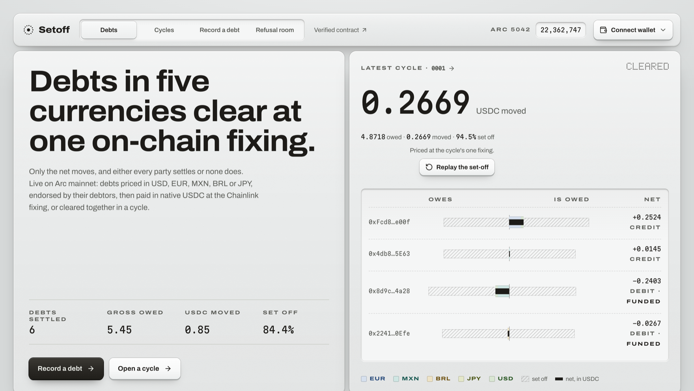

<div align="center">



[](https://github.com/emmanuelist/setoff/actions/workflows/ci.yml)
[](LICENSE)
[](#tests)
[](https://explorer.arc.io/address/0x8A78B1F880eA21dAe046Ff22De9Ccc21027680d6)

### Debts in five currencies clear at one on-chain fixing: only the net moves, and either every party settles or none does.

Four businesses owing each other in USD, EUR, MXN, BRL and JPY normally make four payments and
buy currency four times. Netting them off-chain is easy; the hard part is that nobody will act
on a net they cannot check, and no party will pay first. Setoff puts the whole thing on Arc:
every debt is endorsed by the party who owes it, priced **once** at one Chainlink fixing that is
stored with its round ID, and settled in a single transaction. If even one party fails to fund,
the cycle is voided and every deposit comes back.

This cannot be ported by swapping an oracle. It settles in the **native currency of the chain**,
which on Arc *is* USDC. No ERC-20 approvals, no wrapper, no settlement asset to choose, and gas
paid in the same unit as the debt. Move it elsewhere and "pay the net in the money the chain is
denominated in" stops being a sentence that means anything.

**[Watch the demo · 1:41 ↗](https://youtu.be/4KKoGLYV9E0)** · **[Live app ↗](https://setoff-omega.vercel.app)** · **[The contract, verified ↗](https://explorer.arc.io/address/0x8A78B1F880eA21dAe046Ff22De9Ccc21027680d6)** · **[How it works ↗](#how-it-works)** · **[Run it ↗](#run-it-locally)**

_Reading Arc mainnet live. Every figure on that page is a contract read, an event, or a Chainlink answer._

</div>

---

## Demo

[](https://youtu.be/4KKoGLYV9E0)

**[▶ Watch on YouTube, 1:41](https://youtu.be/4KKoGLYV9E0)**

Filmed against the deployed app reading Arc mainnet, not a mockup and not a reconstruction.
It opens on Herstatt in 1974, shows a real cycle of five debts in five currencies setting off
to a single net at one Chainlink fixing, then shows a second cycle being voided because one
party never funded, with the funded party's deposit coming back in full. It closes on the
17 refusals, run live against the contract.

---

## Proof: nothing here is a mockup

No demo mode, no seeded database, no fixtures. There is no backend and no database at all: the
chain is the only store, and every figure in the UI is a contract read, an event, or a Chainlink
answer. Click any of it.

**The app.** <https://setoff-omega.vercel.app>. No login, nothing seeded, reading Arc mainnet at
request time.

**The contract.** [`0x8A78…80d6`](https://explorer.arc.io/address/0x8A78B1F880eA21dAe046Ff22De9Ccc21027680d6)
on Arc mainnet, block 22,187,522. Sourcify **exact match**. No owner, no admin key, no pause over
balances, and every payout is a withdrawal.

**A cycle that settled.** [Cycle #1](https://explorer.arc.io/tx/0x6f840be9a2501cb80d4223ca7690577b987522c1bf5b7513a418c45f0d0ba10d). Five debts in five
currencies, **4.8718 USDC owed gross, 0.2669 USDC moved. 94.5 % set off**, every debt netted in
one transaction.

**A cycle that did not.** Cycle #3 had two net debtors; one funded, one never did. At the deadline
[anyone could void it](https://explorer.arc.io/tx/0x5ec942bfc6c3f551fed264e1477c9b11a098f233708de501242d15564d360e3b),
and the funded party's **0.4279625 USDC came back to the wei**. Its balance fell by exactly its
four transactions' gas, and all three debts returned to the direct path still endorsed. That is
the "or none does" half of the claim, on-chain rather than in a test.

**The first debt ever paid**, on milestone 1's contract
[`0xcbEb…3ce7`](https://explorer.arc.io/address/0xcbEb5Cf09d311f69D7FdF71F80A6BfE513333ce7)
(also Sourcify exact match, kept as its own record): MXN 10.00 → 0.5804588 USDC at that day's
fixing.

**The refusal room.** 17 attempts run against the live contract as read-only calls: stale rates,
underpayment, paying someone else's debt, settling a cycle twice, voiding one that already
settled. 15 must be refused *by name*, and 2 honest controls must clear. The contract answers in
its own words, decoded from its revert data: `StaleFixing`, `Underpaid`, `NotDebtor`,
`WrongCycleState`.

Every mainnet transaction, with gas and receipts, is in [`docs/EVIDENCE.md`](docs/EVIDENCE.md).

---

## How it works

A debt is recorded by its **creditor**, in the currency it was invoiced in. It counts for nothing
until the **debtor endorses** it, so neither side can invent a debt the other did not accept. From
there it takes one of two paths.

**On its own.** The debtor pays in native USDC at today's fixing: the rate the Chainlink feed
*last published*, never a live quote. The answer, round ID and update time are stored and emitted
with the payment. A rate older than `maxFixingAge` (90,000 s, the 24 h FX heartbeat plus an
hour of grace) is refused outright. The creditor then withdraws.

**In a cycle, against everything else.** Debts enrol until a cutoff. At the cutoff, **one Chainlink
read per currency** prices every debt in the cycle, and that single published rate *is* the fixing.
Each party's debts are set off against what it is owed, leaving only its net. Only net debtors
fund, once, before the deadline. If all of them do, one transaction credits every net creditor and
nets every debt. If even one does not, the cycle is voided and **every deposit is refunded in
full**, with each debt returned to the direct path, still endorsed.

Three properties do the work, and each is an invariant before it is a function:

- **Nets sum to exactly zero at every fixing.** Each debt is priced once and that one figure is
  applied to both sides, so there is no rounding dust to argue about.
- **No partial settlement.** A cycle is settled or void. There is no state where some parties paid
  and others did not.
- **Nothing is pushed.** Payouts are withdrawals, because on Arc a native transfer can revert even
  with sufficient balance, so a blocklisted account must only ever block itself.

Cycles are size-capped (16 debts, 8 parties) so the fixing and settlement fit in one block.

### Arc, specifically

Arc is not Ethereum, and the contract is written for it rather than ported to it:

- **USDC is the native currency.** 18 decimals natively, 6 through its ERC-20 view, one shared
  balance. Accounting is in native units only; `msg.value` and `balanceOf()` are never mixed.
- **Gas is paid in USDC**, so the unit of the fee is the unit of the debt.
- **A native transfer can revert with sufficient balance** → withdrawals only.
- **Block timestamps are non-decreasing, not strictly increasing** → every deadline is written
  with explicit `>=` and `<`, and no window is shorter than ten minutes.
- **Finality is instant**, so the UI never shows a pending state or waits for confirmations.

---

## Tests

```text
56 passing · 0 failing · 4 suites          arc-forge test --network arc
```

Unit and fuzz tests (1,024 runs) plus **7 invariants**, each at 256 runs over 16,384 calls with
`fail_on_revert`. The invariant handler is instrumented to prove it actually reaches the states it
claims to test: across a run it reached `settle` 916 times and `voidCycle` 973 times, so the
no-partial-settlement and refund invariants are exercised rather than vacuously true.

Failure paths are the point, not an afterthought: a stale feed, a negative rate, an unfunded
cycle, a recipient that reverts on receipt, repeated block timestamps, and rounding at the cap.

Four fork tests against mainnet state are skipped unless `ARC_RPC_URL` is set:

```bash
ARC_RPC_URL=https://rpc.mainnet.arc.io arc-forge test --network arc
```

CI runs the app gate: lint at zero warnings, typecheck, build, and a check that `DESIGN.md`
matches the shipped stylesheet. The contract suite runs locally, because Arc Foundry is a
checksum-verified binary with no published installer; its results are quoted above rather than
claimed by a badge.

---

## Worth taking further

Netting is not a new idea. It is how CLS settles FX and how every clearing house works. What
has not existed is a version where the parties can check the net themselves, and where nobody
has to go first. That needs three things at once: one agreed price, atomic settlement, and no
privileged operator. Setoff is a small working instance of exactly that.

**What the demo deliberately is not.** Sixteen debts and eight parties per cycle, because a
fixing and a settlement have to fit in one block. Four wallets I control. Dollars, not
thousands. No audit. Those are the boundaries of a two-week build, not of the idea.

**What the real version needs, in the order it would matter:**

- **Local-currency payout.** Creditors are paid USDC at the fixing today. StableFX and
  local-currency stablecoins (MXNB, BRLA, JPYC) are coming to Arc; when they are permissionless,
  the settlement leg moves from "USDC at the fixing" to "the creditor's own currency" **without
  changing the clearing logic**, because the netting already happens in a common unit.
- **Counterparties who are not already on-chain.** The clearing is sound; the onboarding is the
  product problem. A treasurer will not manage four wallets, and the enrolment step is where
  that has to be solved.
- **A cycle bigger than one block.** Past sixteen debts the fixing and settlement need to be
  split across transactions without losing atomicity. That is a real design problem and it is
  the first thing I would work on.
- **An audit**, before anything with a real balance sheet touches it.

**Why this belongs on Arc specifically.** The netting arithmetic would run anywhere. The
settlement design would not: native-USDC payments with no approvals and no allowance surface, a
payout model shaped by the fact that an Arc transfer can revert on a live account, and finality
that makes "either every party settles or none does" enforceable rather than probabilistic. On a
chain where USDC is an ERC-20 with probabilistic finality, this needs approvals and confirmation
delays, which is a different and weaker product.

---

## Limits

Naming these is cheaper than having a judge find them.

- **No audit.** The contract has no owner and no admin key over user funds, but nobody else has
  reviewed it.
- **The four parties are wallets I control**, for the demo. Every function is open, so anyone can
  record their own debts and open their own cycles.
- **No currency changes hands.** Debts are *priced* in five currencies and *settled* in USDC at
  the fixing. Nobody receives pesos or yen.
- **Amounts are dollars, not thousands**, because this is real money on mainnet.
- **Five currencies, four feeds.** USD settles at par by definition; EUR, MXN, BRL and JPY each
  read a Chainlink `AggregatorV3` proxy. A currency without a feed cannot be billed.
- **Cycles are capped** at 16 debts and 8 parties so a fixing fits in one block. Nothing here
  scales to a clearing house as written.
- **Page latency is bound by Arc's public RPC**, which answers in roughly 1.4 s per round trip.
  The app streams its shell first so it paints immediately, but the figures arrive at RPC speed.

---

## Run it locally

The app reads mainnet directly; no key is needed to browse it.

```bash
cd apps/web
npm ci
cp .env.example .env     # optional: only to point at a fork
npm run dev
```

Contracts, with Arc Foundry. Use `arc-forge`, **not** stock `forge`, so the suite runs under
Arc's native-USDC rules rather than plain-ETH semantics:

```bash
cd packages/contracts
arc-forge build
arc-forge test --network arc
```

Writing to mainnet needs funded keys in `.env` (mode 600). Every mainnet drill is rehearsed
against a fork first; see [`scripts/mainnet/`](scripts/mainnet/).

## Repo

```text
packages/contracts   Foundry: Setoff.sol, tests, invariants, deploy and drill scripts
apps/web             Next.js 16 · React 19 · viem. Reads the chain, no backend
docs/                RESEARCH · DECISIONS · EVIDENCE · SUBMISSION
```

Why things are the way they are is in [`docs/DECISIONS.md`](docs/DECISIONS.md); the built visual
system is in [`DESIGN.md`](DESIGN.md).

---

<div align="center">

MIT · built for [Arc Microgrants](https://dorahacks.io/hackathon/arc-microgrants/detail) by
[emmanuelist](https://github.com/emmanuelist)

</div>
